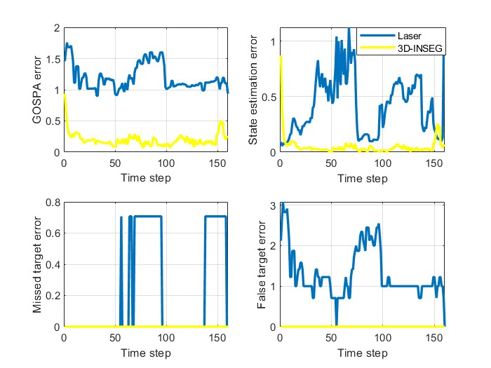

Due to memory limitations, only one scenario is presented. Below are the analyzed sequences:

## Crossing Path Sequence

  

Estimates when the laser data is processed by the PMBM-GGIW algorithm:

## Laser Data Estimates

  

Estimates when the 3D-INSEG data is processed by the PMBM-GGIW algorithm:

## 3D-INSEG Data Estimates

  

Comparison of the performances:

## Performance Metrics Comparison

  

## Cardinality Comparison

  

