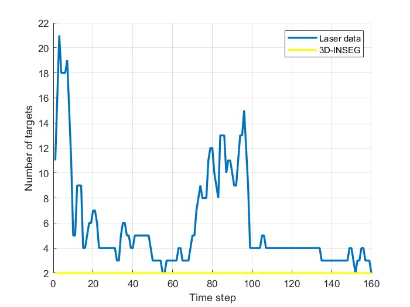

Due to memory limitations, only one scenario is presented. Below are the analyzed sequences:

## Crossing Path Sequence

  

This [video](https://youtu.be/QC90xarYXYo) displays the resulting measurements through an animation.

Estimates when the laser data (with survaillence area [-2,2] meters for x-axis and [0,5] meters for z-axis) is processed by the PMBM-GGIW algorithm:

## Laser Data Estimates

  

Estimates when the 3D-INSEG data is processed by the PMBM-GGIW algorithm:

## 3D-INSEG Data Estimates

  

Comparison of the performances:

## Performance Metrics Comparison

  

## Targets cardinality estimated by the extended PMBM filter using the laser data and the 3D-INSEG data

  

