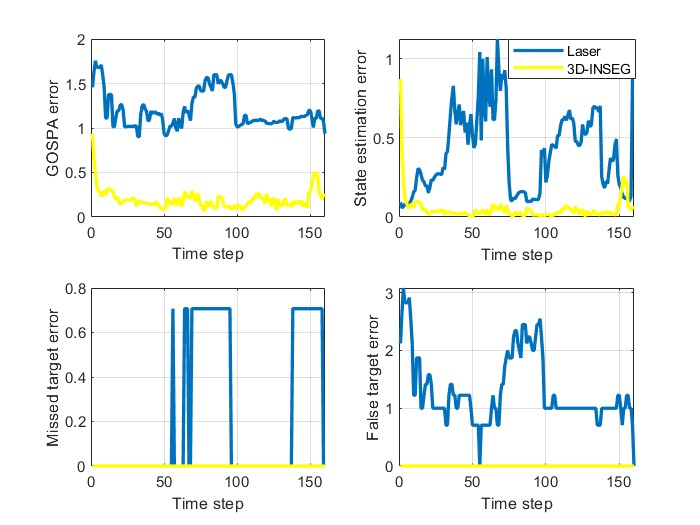
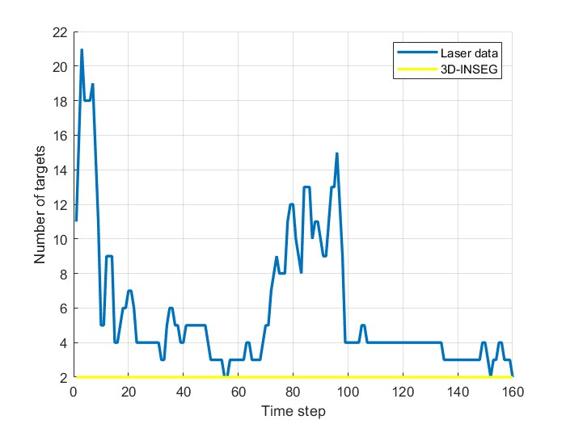

Only one scenario is shown because of space limitations. The anayzed sequence is shown:

The estimates when the laser data is processed by the PMBM-GGIW:

The estimates when the 3D-INSEG data is processed by the PMBM-GGIW:

The comparison of the performances:

